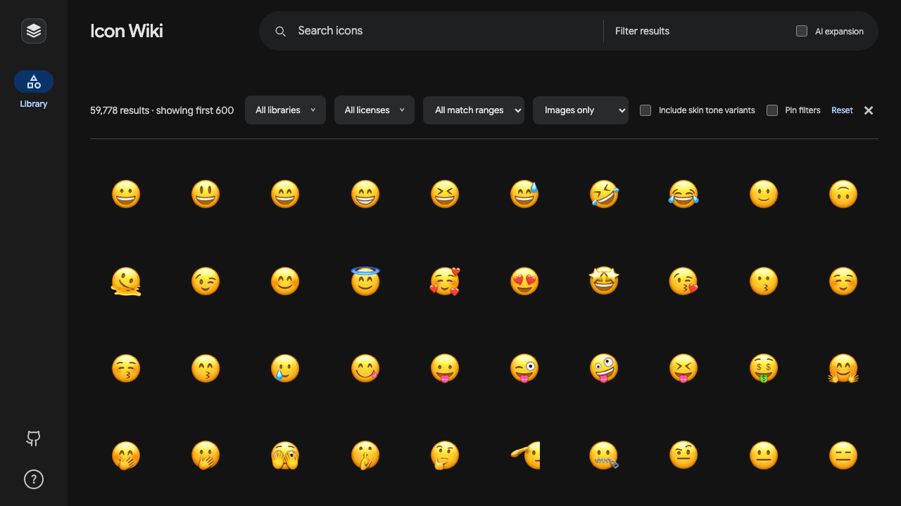
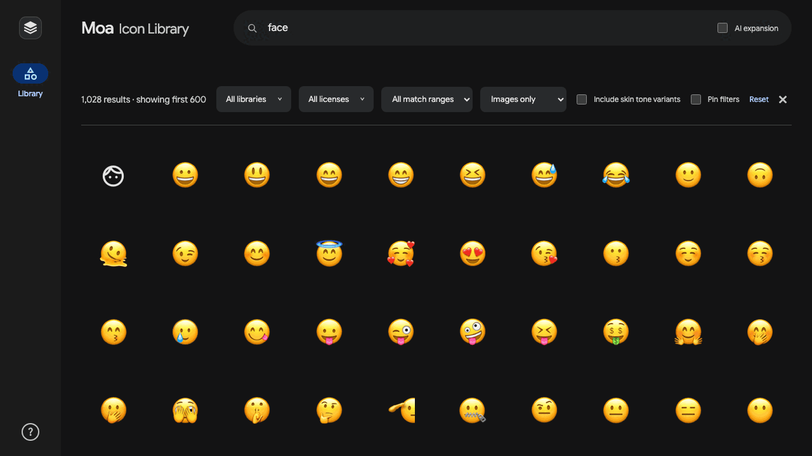
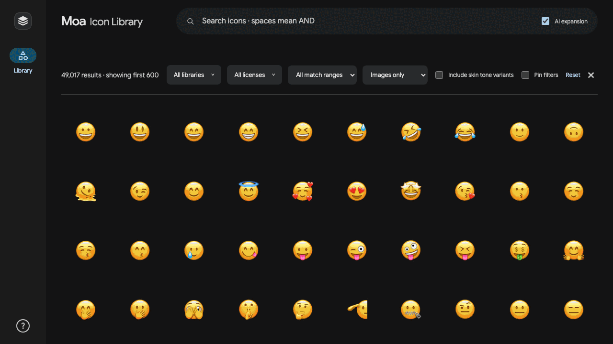

# Moa — Free icon libraries, all in one place.

Free Icon & Emoji Browser

**Try Moa at [moa.aoo.kr](https://moa.aoo.kr)**

Over 56,000 icons and emoji from 15 libraries.

## Key features

- Find icons by name, keyword, or category.
- Filter by library, license, match type, and skin tone.
- Compare styles side by side.
- Check each icon's source and license.

### Narrow your search

Search for `face`, then add `smile` to narrow the results.



### Discover related icons

Turn on **AI expansion** to include related search terms.



### Search in your language

Enter `캥거루` (Korean for “kangaroo”) to find matching icons.



AI expansion and multilingual search require support for Chrome's built-in AI. Standard search works without it.

## Included libraries

| Library | Version | License | Items |
| --- | ---: | --- | ---: |
| Unicode Emoji | 17.0 | [Unicode-3.0](./data/sources/UNICODE-LICENSE.txt) | 3,953 |
| Google Noto Emoji | 2.051 | [Apache-2.0](./data/sources/NOTO-EMOJI-SVG-LICENSE.txt) | 3,691 |
| Microsoft Fluent Emoji Color | — | [MIT](./data/sources/FLUENT-EMOJI-LICENSE.txt) | 3,145 |
| Google Material Symbols Outlined | — | [Apache-2.0](./data/sources/MATERIAL-SYMBOLS-LICENSE.txt) | 3,912 |
| Pictogrammers Material Design Icons | 7.4.47 | [Apache-2.0](./data/sources/MATERIAL-DESIGN-ICONS-LICENSE.txt) | 7,447 |
| OpenMoji Color | 17.0.0 | [CC-BY-SA-4.0](./data/sources/OPENMOJI-LICENSE.txt) | 4,495 |
| Tabler Icons | 3.47.0 | [MIT](./data/sources/TABLER-LICENSE.txt) | 5,148 |
| Lucide | 0.577.0 | [ISC](./data/sources/LUCIDE-LICENSE.txt) | 1,703 |
| Phosphor Icons | 2.1.1 | [MIT](./data/sources/PHOSPHOR-LICENSE.txt) | 9,072 |
| Heroicons | 2.2.0 | [MIT](./data/sources/HEROICONS-LICENSE.txt) | 648 |
| Font Awesome Free | 7.3.1 | [CC-BY-4.0](./data/sources/FONT-AWESOME-FREE-LICENSE.txt) | 2,883 |
| Bootstrap Icons | 1.13.1 | [MIT](./data/sources/BOOTSTRAP-ICONS-LICENSE.txt) | 2,078 |
| Microsoft Fluent UI System Icons | 1.1.341 | [MIT](./data/sources/FLUENT-SYSTEM-ICONS-LICENSE.txt) | 5,468 |
| Iconoir | 7.12.1 | [MIT](./data/sources/ICONOIR-LICENSE.txt) | 1,671 |
| Ionicons | 8.1.0 | [MIT](./data/sources/IONICONS-LICENSE.txt) | 1,357 |
| **Total** |  |  | **56,671** |

## Run locally

```bash
npm start
```

Open [localhost:4174](http://127.0.0.1:4174).

Rebuild the icon catalogs:

```bash
npm run data
```

## License

Moa's code is licensed under the [MIT License](./LICENSE). Icons and emoji retain their original licenses, listed above and in [Third-Party Notices](./THIRD_PARTY_NOTICES.md).

---

**Moa** comes from **모아**, Korean for “collect” or “gather together.”
